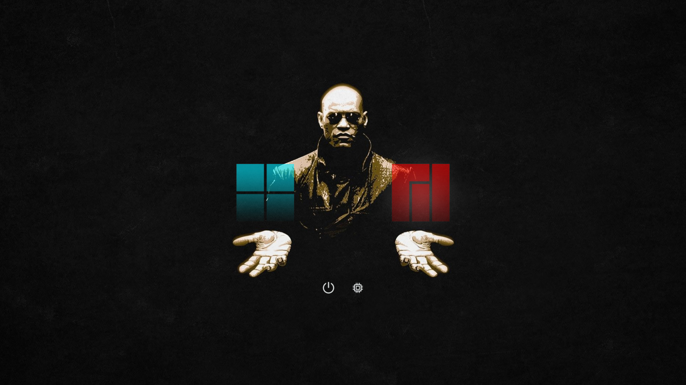

# Matrix-rEFInd

A Matrix theme for [rEFInd](https://rodsbooks.com/refind/).

### Usage

Clone this repository into a `themes` directory located inside the refind EFI directory
(usually `/boot/EFI/refind`)

Then add `include themes/Matrix-rEFInd/theme.conf` at the end of the refind.conf.

You probably also need to hide some unwanted boot options to only display the two wanted options.
For this take a look at [hiding EFI bootloaders](https://rodsbooks.com/refind/configfile.html#hiding).

### Sources

The original image can be found here: https://i.imgur.com/c1Z62Q2.jpg.

The icons can be found here: https://github.com/SLywnow/hi-themes-refind.